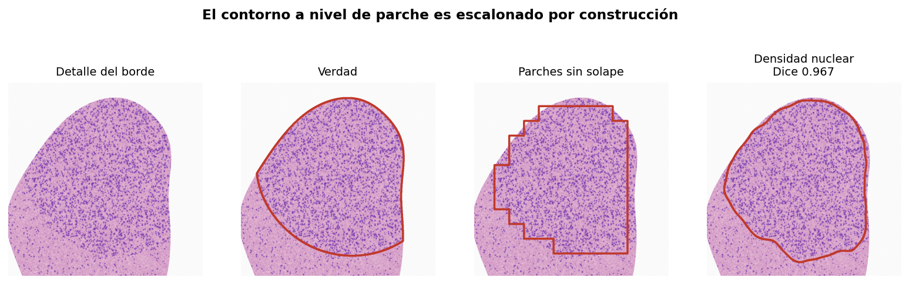
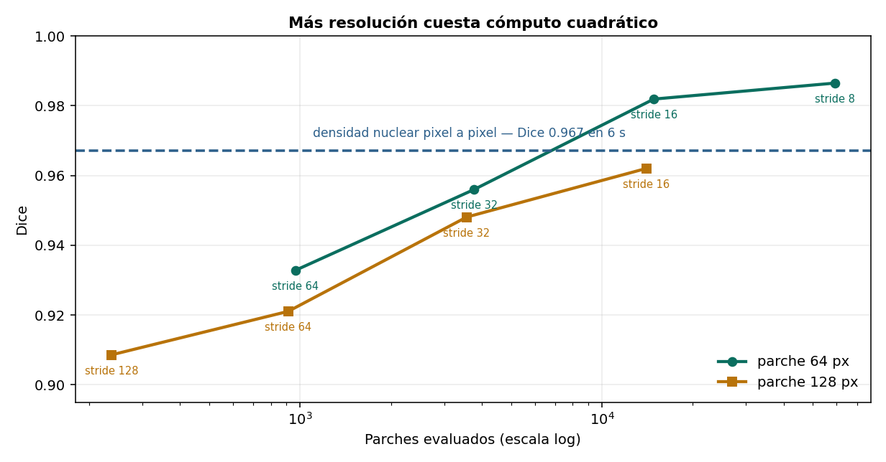
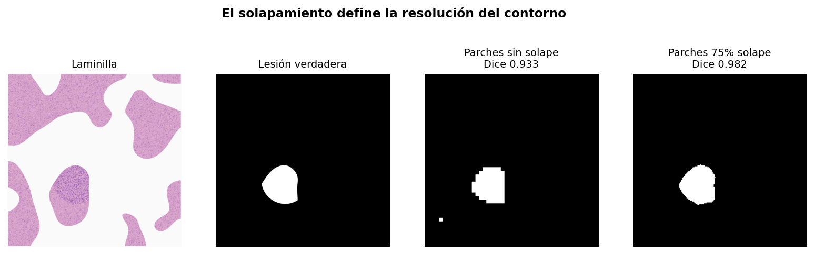

# Del parche al contorno: segmentación de lesiones

Construcción de mapas de lesión por dos caminos —clasificación de parches solapados y
análisis nuclear pixel a pixel— con medición del compromiso entre resolución y cómputo.



## Resultado principal

**Un método clásico bien elegido gana a la clasificación de parches, a una fracción del
costo.**

| Método | Dice | Tiempo |
|---|---|---|
| Parches 64 px, sin solape | 0.933 | 1.4 s |
| Parches 64 px, 50% solape | 0.956 | 5.2 s |
| **Densidad nuclear pixel a pixel** | **0.967** | **6 s** |
| Parches 64 px, 75% solape | 0.982 | 19.9 s |
| Parches 64 px, 88% solape | 0.986 | 80.9 s |

En este problema el criterio que define el tumor *es* la densidad nuclear, y el método
clásico la mide directamente mediante deconvolución de tinción (`rgb2hed`) y watershed.
Cuando se conoce el mecanismo, medirlo gana a aprenderlo.

**Advertencia:** esto no generaliza a patología real, donde el diagnóstico combina
pleomorfismo, arquitectura, relación núcleo-citoplasma y patrón de invasión. Un contador de
núcleos captura uno de esos criterios.

## El compromiso resolución / cómputo



| Parche | Stride | Parches | Dice |
|---|---|---|---|
| 64 | 64 | 966 | 0.933 |
| 64 | 8 | 59,091 | 0.986 |
| 128 | 16 | 14,040 | 0.962 |
| 64 | 16 | 14,862 | **0.982** |

Pasar de stride 64 a stride 8 sube el Dice 5.7 puntos a cambio de **61×** más cómputo.

A igual costo, el parche pequeño gana: con ~14,000 parches, 64 px logra 0.982 y 128 px solo
0.962. Un parche grande difumina el borde que se quiere delimitar.

## Por qué el contorno de parches es escalonado



La unidad mínima de decisión es el parche, así que el borde no puede tener más resolución
que el stride. Es geometría, no falta de datos.

El entrenamiento usa solo parches puros (>90% o <2% tumoral); los de borde contienen mezcla
y no tienen etiqueta clara. **El borde es donde el modelo no tiene supervisión.**

## Contenido

```
notebooks/segmentacion_wsi.ipynb   Notebook completo, ejecutable sin datos externos
src/sintetica.py                   Generador de laminilla con lesión de borde irregular
src/extractores.py                 Descriptores de textura (LBP + Haralick)
src/mapa.py                        Mapa de lesión por parches solapados
src/nuclear.py                     Detección nuclear (rgb2hed + watershed) y densidad
figuras/                           Figuras generadas
```

## Reproducir

```bash
git clone https://github.com/USUARIO/wsi-segmentacion.git
cd wsi-segmentacion
pip install -r requirements.txt
jupyter lab notebooks/segmentacion_wsi.ipynb
```

No requiere descargar datos. El barrido completo tarda unos minutos.

## Segmentación supervisada

Para contorno pixel a pixel con contexto, la referencia son U-Net y las arquitecturas con
atención:

```python
import segmentation_models_pytorch as smp
modelo = smp.Unet(encoder_name='resnet34', encoder_weights='imagenet',
                  in_channels=3, classes=1)
perdida = smp.losses.DiceLoss(mode='binary')   # el tumor es el 8.6% del tejido
```

Requiere anotaciones pixel a pixel de patólogo. CAMELYON16 las incluye.

## Limitaciones

El tumor está definido por un solo criterio (densidad nuclear).

No hay anotación de patólogo: la verdad es la máscara generadora. Con anotaciones reales
aparece la variabilidad inter-observador y el techo de Dice baja.

El Dice mide solapamiento promedio. Para márgenes quirúrgicos importa la distancia de
Hausdorff: un Dice de 0.96 con una protuberancia no detectada puede ser peor que 0.93
uniforme.

El watershed depende de `min_distance`; con núcleos apiñados (el caso tumoral) tiende a
fusionarlos y subestima la densidad donde más importa.

## Referencias

- Ronneberger O., Fischer P., Brox T. *U-Net: Convolutional Networks for Biomedical Image Segmentation.* MICCAI, 2015.
- Xie E. et al. *SegFormer: Simple and Efficient Design for Semantic Segmentation with Transformers.* NeurIPS, 2021.
- Ruifrok A., Johnston D. *Quantification of histochemical staining by color deconvolution.* Anal Quant Cytol Histol, 2001.

## Licencia

MIT — ver [LICENSE](LICENSE).
